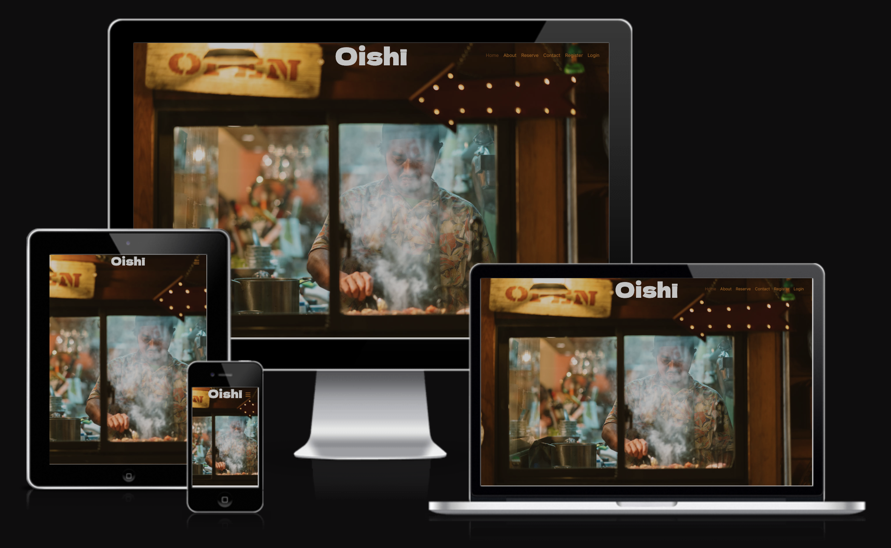
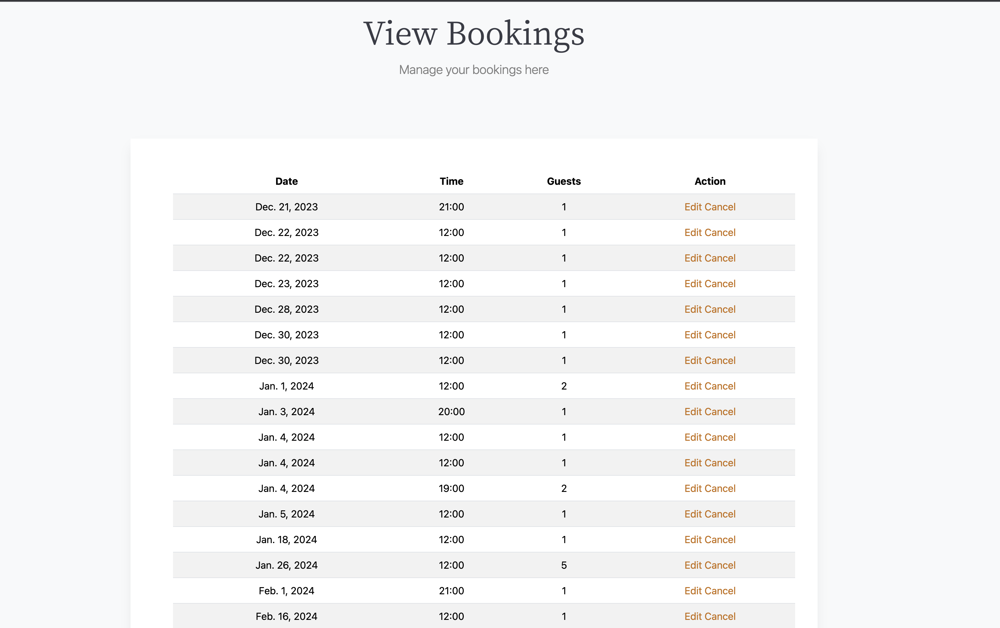
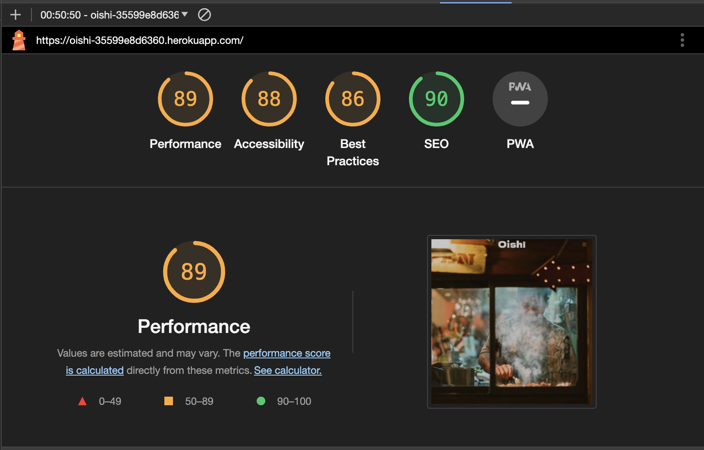

# Oishī Restaurant

[Live application can be found here](https://oishi-35599e8d6360.herokuapp.com/)

## About
This is a project for a full-stack framework built using Django, Python, Javascript, HTML, and CSS. The project is designed for an imaginary Japanese restaurant named Oishī and was created as a part of Code Institute's portfolio four for educational purposes. The website serves as a platform for showcasing the restaurant and allows customers to make, edit, and delete reservations through their personal accounts.

## Business Goals
The following text has been revised for clarity and corrected for any spelling, grammar, and punctuation errors:

- The restaurant's brand values and identity should be communicated through visual language, styling, and text on the website. 
- This will help to entice interest and encourage further exploration of the website. 
- The website should also be designed to appeal to the target demographic and provide them with the necessary information about the restaurant. 
- Additionally, it should offer a platform for potential customers to book a table at the restaurant.
 
## User Experience

### Target Audience

- 25-60 year olds.
- People interested in food, fine-dining and eating-out.
- People who are interested in culture, travel and local hotspots.

### User Requirements and Expectations
- A user-friendly website that balances information with an aesthetic that communicates the restaurant's values and appeals to the target customers.
- A mobile-friendly website as bookings are often made on the go. 
- Information about the restaurant, the types of dishes it serves and who runs it.
- A way to book a table.
- A way to view and manage reservations.
- Contact information and address.
- A way to easily access social media accounts from the website.

## User Stories

Agile  was used to keep development in line with the core requirements of the project. In Github a kanban board was created where the user stories 
were located. This made it easy to keep track of getting the essential aspects of the project covered as well as being able to see progress happening as 
the project progressed.

1. As a user I can intuitively navigate through the website so that I can easily access key information and view desired content. 
2. As a user I can easily see if I'm logged in or not so that I can choose to log in or log out depending on what I'm doing.
3. As a non-registered user I can make a booking so that I don't need to spend time setting up an account..
4. As a non-registered user I can set up an account so that I can view and manage potential bookings or any previously made bookings
5. As a logged-in user I can make a booking without filling in account information like name and email so that bookings can be made easily without causing annoyance.
6. As a logged-in user I can easily view all my bookings so that I can see any upcoming reservations.  
7. As a logged-in user I can edit an existing booking so that I can change the time, date or number of guests in a booking.
8. As a logged in user I can delete an existing booking so that I can remove any unwanted reservations.
9. As an admin user I can view all the customer bookings. 
10. As an admin user I can add and delete tables in the Table model.
11. As an admin user I can add, edit and delete bookings. 

## Scope
As a MVP the website has to achieve the essential user & business goals. The following features will be included in this version:

- A responsive navbar that will have links to all the sections and pages on the website.
- A visually strong landing page that entices the user to further exploration of the business.
- Visual language and styling that reflects the brands values and appeals to the target audience.
- About section with a brief suitable description of the restaurant with three images. 
- Specials section showcasing some of the menu items on offer. 
- Chef section describing the head chef with an image. 
- Reservations section, where logged-in and logged-out users can make reservations.
- A footer section with contact information, social media links, site links and opening times. 
- Register and login pages using Django Allauth.
- A view bookings page to manage bookings.
- An edit bookings page.
- A delete bookings page.
- A logout page for logged in users.  

## Front-End Design

### Brief
- Communicate the brand values through visual language, styling and text.
- Appeal to the target audience. 
- Easily  navigate and locate necessary information for optimal user expeerience.

### Images

- A strong landing image is used. This entices interest urging a potential customer to explore the website further and find out more. 
- Further images are used to communicate brand values, offer visual stimulation and provide information such as types of dishes and the head chef. 

### Colours
#### Background Colours
- The website uses a light theme throughout. This works well in creating a clean, modern and refined feel to the content as well as enhancing readability.
- As one scrolls down through the sections, the background colour changes from a shade of white to a light grey giving a subtle sense of seperation to the content.

#### Styling Colours

- The brand logo, section headings and the footer background utilize a dark grey, offering contrast and easy readibility.
- The home page brand logo uses a shade of white to stand out. 
- A orange hue was choosen for the sub-headings, buttons and as a hover border on form fields. This was picked form the home image using [imagecolorpicker.com](https://imagecolorpicker.com/).
As well as achieving a strong contrast it offers a sense of continuity and harmony as these colours will have been first noticed upon viewing the landing page image.
- A darker shade of this orange was used to show the active navigation link.
- Paragraph text colour is grey offering a clean minimal look as well as good readability.

### Fonts
- Google fonts Dela Gothic One is used on the brand logo. 
Its thick bold character design and Japanese influence aligns well with the brand's confidence, youthfullness and location. 
It also contrasts well with the background image and prevents an over-sterile feel creeping in from the minimal sans-serif used in the nav-bar links and texts in the website. 

- Noto Serif JP, again from Google fonts, is used on the section headings. It links well to the Japanese heritage of the restaurant while still being subtle and refined.

- Sans-serif is used on the paragraphs section of the website. It offers a clean, refined and legible design, which makes it easy to read on screens of different sizes and resolutions. It has a neutral appearance and doesn't have any distracting features that can make it difficult to read. 

## Back-End Design

### User Model
- User model as part of the Django Allauth library contains basic information about the authenticated user and contains the folowing fields: username, password and email.
     
### Table Model

- This custom model stores the tables in the restaurant.
- Each table has a number and the number of seats.

### Booking Model

- This custom model holds all the restaurant bookings. 
- It stores the date, time, number of guests, table, customer name and email.
- The table field is taken from the Table model and the customer name from the logged-in Allauth user model.
- It also has a guest name field for non-registered users in which case the customer field is not used. 

### Flowchat

- When making a booking on the reservation section, the form fields displayed will depend on the user being logged in or not.
- It was import that logged in users were not entering account information like username and email as this would be fustrating. 
- Equally, it was important that non-registered users could make a booking without having to go through the sign-up process. Therefore, a guest user field was included in the Booking model to  handle this. The guest will haver to enter thier email when making a booking. Any  past bookings accociated  with this email will be retrivied if the user decides to create an account later. 
- Once the booking form is validated the code checks if there are any available tables.
- If so, it was important that tables were assigned according to the number of guests, not just the first table from the Table Model.
- The code then finds the best matched table to exclude or lower the number of empty seats. 
- If more that three empty seats is the only availability the booking will not proceed as there will be too many empty seats.

        

## Features

### Navigation Bar & Landing Page

Situated on the top-right of the pages, provides the user with a clear and easily identifiable way to go between the sections and pages. The page that the user is on has an 'active' style, the text turns a darker orange to show to the user the current page they're on. When a nav link is hovered on the same style change occurs, again helping th euser navigate easily.

Wither the user is logged in or logger out will determine wither nav links are shown or not; only logged in users can will see the "logout" link and likewise only
logged out users will see the "login" and "register" links. 
This prevents any frustration on the users part, keeps the screen clutter free and enables easier navigation. Furthermore, it makes it clear what the logged-in status is to the user.
In terms of styling, the navigation links strike a balance between being easily located while also discrete enough as not to distract for the main landing images visual power.
The navigation bar is fully responsive and collapses on mobile screens to a hamburger icon on smaller-sized screens. 

Logo: The logo sits in the centre of the nav bar. This works well with the image used as it draws the eye from the central action in the photo naturally to the logo and back. It uses an off-white colour to stand out.

 
### About Section

- This provides the user with a brief to-the-point description of the restaurant. Its purpose is to provide information and visual stimulation as well as entice further exploration.

### Specials Section

- In this section, further details are given on some of the signature dishes on offer along with an accompanying image.
- A Bootstrap card template was modified to make this section. The use of the colour for the subheadings as well as being capitalised
helps add variation and injects a hint of colour to the texts. 
  
### Chef Section

- Here a description of the head chef and his background is given with a suitable image.

### Reserve Section

- The displayed reservation form fields will depend on wither the user is logged in or not. 
- Links in the description are provided for easy access to the login and register pages for logged out users. 
- For logged in users a link os provided to the view bookings page.  
 
### Register/Login/Logout pages

 This is done through Allauth. In setting up an account an email is necessary. This is because a user is more likely to use the same 
 email address rather that username if they make a booking as a guest first and then wish to register an account. Also, the restaurant needs a point of contact.
 The same form template is used throughout with tweaks made according to the number of fields rendered to allow for the most symetrical rendering. 

### View Bookings page

- Only accessible to logged in users.
- Here their bookings are displayed in a table in order of date. All reservations they have previously made using the email address associated with their user account will be shown.
- Each booking has a link to the edit booking and cancel booking pages. 
- A Bootstrap table template is used to present the details clearly.
- A link is provided to the reservation section to make new bookings. 

### Edit/Cancel Booking pages

- Only accessible to logged in users through the Manage Bookings page. 
- On these pages, the user can change or delete their bookings.
- If a booking is deleted, they are redirected abck to the view bookings page where a confirmation message will appear.
- On the edit page new booking enquiries can be made. 

### Footer Section

- The footer displays some of the restaurant's key information. It is split into four sections, social medial links, 'Opening Times', 'Contact', 
and 'Useful Links'. 
- It utilizes a dark grey background and has the effect of giving a strong end to the website. 

## Manual Testing of User Stories

<mark>WAS = Works as expected</mark>

### 1. As a user I can intuitively navigate through the website so that I can easily access key information and view desired content.

**Step** | **Expected Result** | **Actual Result**
------------ | ------------ | ------------ |
Navigating to :https://.herokuapp.com/ | home page loads | WAS |
User scrolls through the home page | Content of the page is presented | WAS |
User click on a Link in the nav bar | user taken to desired part of the web app | WAS |

### 2. As a user I can easily see if I'm logged in or not so that I can choose to log in or log out depending on what I'm doing.

**Step** | **Expected Result** | **Actual Result**
------------ | ------------ | ------------ |
Navigating to :https://.herokuapp.com/ | home page loads | WAS |
Logged out user views nav-bar | "Login" link is shown | WAS |
Logged in user views nav-bar | "Logout" link is shown | WAS |

### 3. As a non-registered user I can make a booking so that I don't need to spend time setting up an account.

**Step** | **Expected Result** | **Actual Result**
------------ | ------------ | ------------ |
Navigating to :https://.herokuapp.com/ | home page loads | WAS |
Click on reservation link in the nav-bar | Site navigates to reservation section | WAS |
Submit form with missing form fields | Prompt is shown to fill in field | WAS |
Use past date in date field | Error message shown | WAS |
Fill in all fields with valid date| Success message displayed. Instance saved in model | WAS |
Fill in form fields on date/time fully booked | Unsuccessfull message displayed | WAS |
Fill in form fields on date/time with no suitable table available | Unsuccessfull message displayed | WAS |

### 4. As a non-registered user I can set up an account so that I can view and manage potential bookings or any previously made bookings

**Step** | **Expected Result** | **Actual Result**
------------ | ------------ | ------------ |
Navigating to :https://.herokuapp.com/ | Home page loads | WAS |
Click on register link in the nav-bar | Site navigates to register page | WAS |
Submit form with missing form fields | Prompt shown to fill in fields | WAS |
Use invalid email address | Error message shown | WAS |
Use already registered email address | Error message shown | WAS |
Use already registered username | Error message shown | WAS |
Use invalid password | Error message shown | WAS |
Use non-matching passwords | Error message shown | WAS |
Fill in all fields with valid data| Redirects to reservation section. Success message displayed. User saved in model | WAS |

### 5. As a logged in user I can make a booking without filling in account information like name and email.

**Step** | **Expected Result** | **Actual Result**
------------ | ------------ | ------------ |
Navigating to :https://.herokuapp.com/ | home page loads | WAS |
Click on login link in the nav-bar | Site navigates to login page | WAS |
User logs in | Site navigates to reservation section. Success message displayed | WAS |
Submit form with no date | Prompt shown to fill in date field | WAS |
Use past date in date field | Error message shown | WAS |
Fill in all fields with valid date| Success message displayed. Instance saved in model | WAS |
Fill in form fields on date/time fully booked | Unsuccessfull message displayed | WAS |
Fill in form fields on date/time with no suitable table available | Unsuccessful message displayed | WAS |

### 6. As a logged in user I can easily view all my bookings so that I can see any upcoming reservations.  

**Step** | **Expected Result** | **Actual Result**
------------ | ------------ | ------------ |
Logged in user navigates to manage bookings | User taken to required page | WAS |
User can see in order of date all their bookings | Bookings displayed in a table | WAS |
User can navigate to edit/cancel booking pages via link|  Edit/cancel links takes the user to the desired page with the desired booking instance | WAS |

### 7. As a logged in user I can edit an existing booking so that I can change the time, date or number of guests of a booking.

**Step** | **Expected Result** | **Actual Result**
------------ | ------------ | ------------ |
User navigates to the edit booking page via the link in the manage booking table | Edit page loads with correct booking instance in the form | WAS |
User does not make any changes to the fields | Warning message appears | WAS |
Submit form with no date | Prompt shown to fill in date field | WAS |
Use past date in date field | Error message shown | WAS |
Fill in form fields on date/time fully booked | Unsuccessful message displayed | WAS |
Fill in form fields on date/time with no suitable table available | Unsuccessfull message displayed | WAS |
Fill in all fields with valid date| Success message displayed. Instance saved in model | WAS |

### 8. As a logged in user I can delete an existing booking so that I can remove any unwanted reservations.

**Step** | **Expected Result** | **Actual Result**
------------ | ------------ | ------------ |
User navigates to the cancel booking page via the link in the manage booking table | Cancel page loads with correct booking instance in the form | WAS |
User can not edit the form field data | Form fields are not editable | WAS |
User deletes the booking by clicking on the form button | Instance is deleted, user redirected to manage bookings page, success message displayed | WAS |
Submit form with no date | Prompt is shown to fill in date field | WAS |

## Code Validation
All of my code has been validated using an online validator specific to the language, all code now passes with zero errors. 

- [W3C Markup Validation Service](https://validator.w3.org/) 
    - Used to validate all HTML code written and used in this webpage.
    - One error exception is the "hx-target="body" in the form element in index.html. This is needed to stop the page from refreshing after submitting.
    

- [W3C CSS Validation Service](https://jigsaw.w3.org/css-validator/#validate_by_input)
    - Used to validate all CSS code written and used in this webpage.
    - No errors shown. 

- [JSHint](https://jshint.com/)
    - Used to validate JS code
    - No errors shown.

- [Code Institute Python Linter](https://pep8ci.herokuapp.com/)
    - Used to test my code for any issues or errors.
    - Some lines in views.py that contained messages were left longer.

- Lighthouse Google Developer Tools
    - In addition to this I have also used online Lighthouse to test the accessibility of my website:

## Bugs and Fixes

 - I noticed that upon submitting the reservation form the form would clear the fields but if the user refreshed the page the booking would be made again. This was resolved by adding a redirect at the end of the reservation function.

 - Once a booking was made, the page now would refresh, and because the reservation form is not at the top of the page, the user would miss the
 subsequent message. This was resolved by using a script from htmx.org to prevent the refresh. This can be found in the head section of base.html.

## Deployment

I followed the below steps using the Code Institute tutorial and [Django Blog cheatsheat](https://codeinstitute.s3.amazonaws.com/fst/Django%20Blog%20Cheat%20Sheet%20v1.pdf)

- The following command in the Gitpod CLI will create the relevant files needed for Heroku to install your project dependencies `pip3 freeze --local > requirements.txt`. Please note this file should be added to a .gitignore file to prevent the file from being committed. A `Procfile` is also required that specifies the commands that are executed by the app on startup. 

1. Go to [Heroku.com](https://dashboard.heroku.com/apps) and log in; if you do not already have an account then you will need to create one.
2. Click the `New` dropdown and select `Create New App`.
3. Enter a name for your new project, all Heroku apps need to have a unique name, you will be prompted if you need to change it.
4. Select the region you are working in.

*Heroku Settings*
You will need to set your Environment Variables - this is a key step to ensuring your application is deployed properly.
- In the Settings tab, click on `Reveal Config Vars` and set the following variables:
    - SECRET_KEY - to be set to your chosen key
    - CLOUDINARY_URL - to be set to your Cloudinary API environment variable
- In the resources tab you must install 'Heroku Postgres'

*Heroku Deployment*
In the Deploy tab:
1. Connect your Heroku account to your Github Repository following these steps:
    1. Click on the `Deploy` tab and choose `Github-Connect to Github`.
    2. Enter the GitHub repository name and click on `Search`.
    3. Choose the correct repository for your application and click on `Connect`.
2. You can then choose to deploy the project manually or automatically, automatic deployment will generate a new application every time you push a change to Github, whereas manual deployment requires you to push the `Deploy Branch` button whenever you want a change made.
3. Once you have chosen your deployment method and have clicked `Deploy Branch` your application will be built and you should see the below `View` button, click this to open your application:

## Technologies Used

- [Django](https://www.djangoproject.com/)
    - Django is the framework that has been used to build the over project and its apps.
- [Python](https://www.python.org/)
    - Python is the core programming language used to write all of the code in this application to make it fully functional.
- [Bootstrap](https://getbootstrap.com/)
    - Used for creating responsive design.
- [Google Fonts](https://fonts.google.com/)
    - Used to obtain the fonts linked in the header, fonts used were Raleway and Lobster
- [Font Awesome](https://fontawesome.com/)
    - Used to obtain the icons used on the high scores and rules pages.
- [Google Developer Tools](https://developers.google.com/web/tools/chrome-devtools)
    - Used as a primary method of fixing spacing issues, finding bugs, and testing responsiveness across the project.
- [GitHub](https://github.com/)
    - Used to store code for the project after being pushed.
- [Git](https://git-scm.com/)
    - Used for version control by utilising the Gitpod terminal to commit to Git and Push to GitHub.
- [Gitpod](https://www.gitpod.io/)
    - Used as the development environment.
- [Heroku](https://dashboard.heroku.com/apps)
    - Used to deploy my application.
- [Lucid](https://lucid.app/documents#/dashboard)
    - Used to create the ERD for the project.
- [Grammarly](https://www.grammarly.com/)
    - Used to fix the thousands of grammar errors across the project.
- [ImageResizer](https://imageresizer.com/)
    - Used to resize images to reduce loading time.
- [Code Institute Python Linter](https://pep8ci.herokuapp.com/)
    - Used to test my code for any issues or errors.
- [Grammarly](https://www.grammarly.com/)
    - Used to fix the grammar errors across the project.
- [Coloors](https://coolors.co/)
    - Used to create a colour palette for the design.
- [Cloudinary](https://cloudinary.com/)
    - Used to store all of my static files and images.
- [Favicon.io](https://favicon.io/)
    - Used to create favicon's for my website
- [W3C Markup Validation Service](https://validator.w3.org/) 
    - Used to validate all HTML code written and used in this webpage.
- [W3C CSS Validation Service](https://jigsaw.w3.org/css-validator/#validate_by_input)
    - Used to validate all CSS code written and used in this webpage.
- [JSHint](https://jshint.com/)
    - Used to validate JS code
- [Freeformatter CSS Beautify](https://www.freeformatter.com/css-beautifier.html)
    - Used to accurately format my CSS code.
- [Freeformatter HTML Formatter](https://www.freeformatter.com/html-formatter.html)
    - Used to accurately format my HTML code.
- [AmIResponsive](http://ami.responsivedesign.is/)
    - Used to generate responsive image used in README file.
- [SQLite](https://www.sqlite.org/index.html)
    - I have SQLite to run my database tests locally.
- [PostgreSQL](https://www.postgresql.org/)
    - I have used Heroku's PostgreSQL relational database in deployment to store the data for my models.

## Further Possible Additions

These are some features that can be implemented in the future.

- More complexity to the reservation function. This could include the possibility of joining certain tables in the restaurant if needed.
- Also, another realistic feature would be to have booking times every half an hour instead of one hour. This would mean each booking would have an end time, of say one hour and thirty minutes after the start of the booking. This would be a more realistic experience. 
- A platform to order a takaway.

## Credits

Throughout the process of building this website, I have used various sources online to provide resources, help me learn & tackle problems.

[IStock](https://www.istockphoto.com/) - All photos used in the project were taken from istock.

[Allauth Styling](https://builtwithdjango.com/blog/styling-authentication-pages) - Used to add classes to the form fields via widgets

[Django reservation system](https://www.youtube.com/watch?v=s5xbtuo9pR0&ab_channel=JohnAbdsho) - A tutorial on how to make a reservation system which helped me further understand the project requirements.

[Bootstrap Nav-bars](https://www.youtube.com/watch?v=7AT1X9Z41sA&ab_channel=NetNinja) - A tutorial on nav-bars in bootstrap.

[Bootstrap Templatees](https://mdbootstrap.com/) - I used the MDB website to get a template for the footer section.

