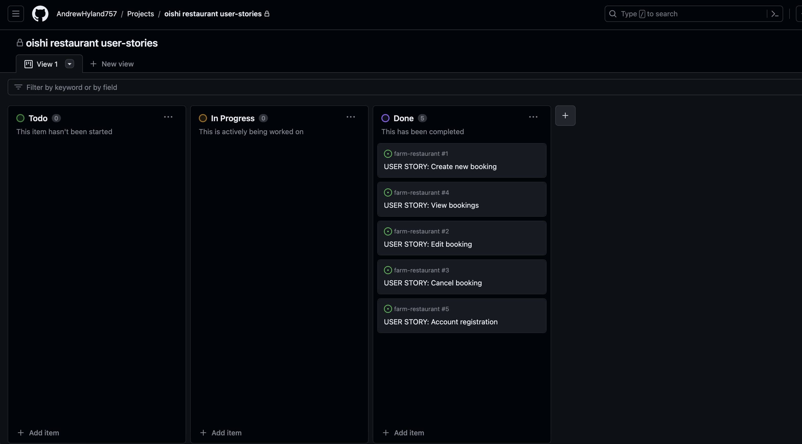
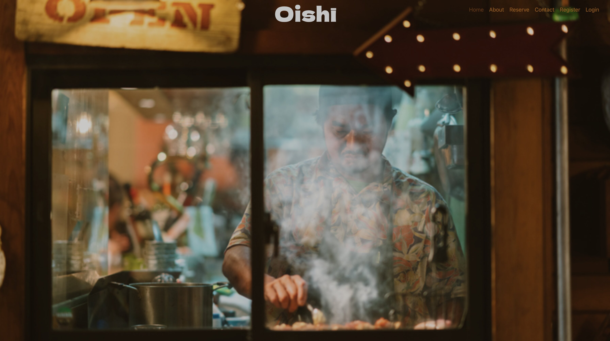
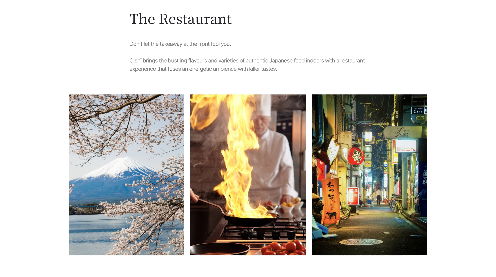
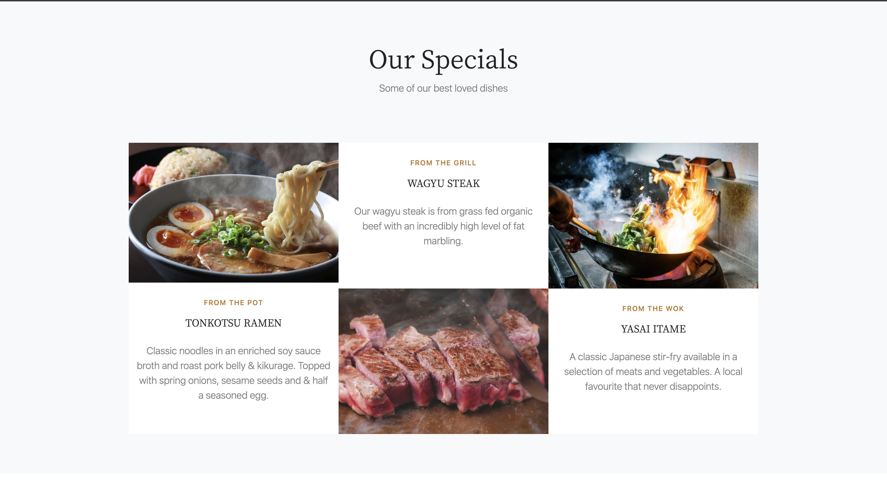
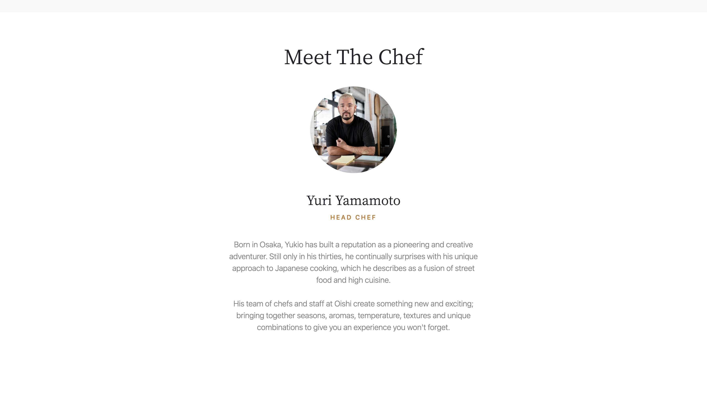
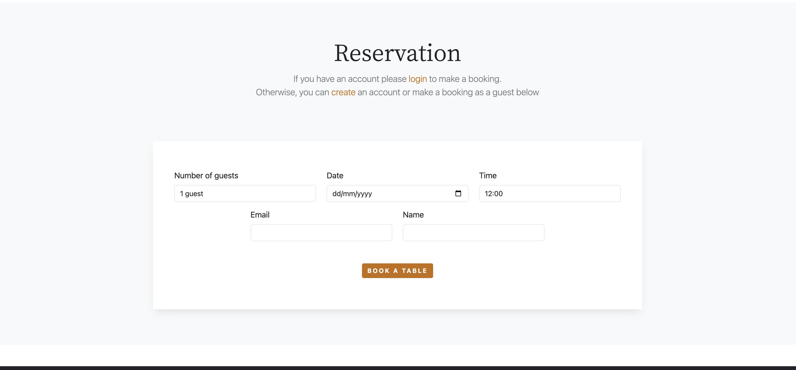
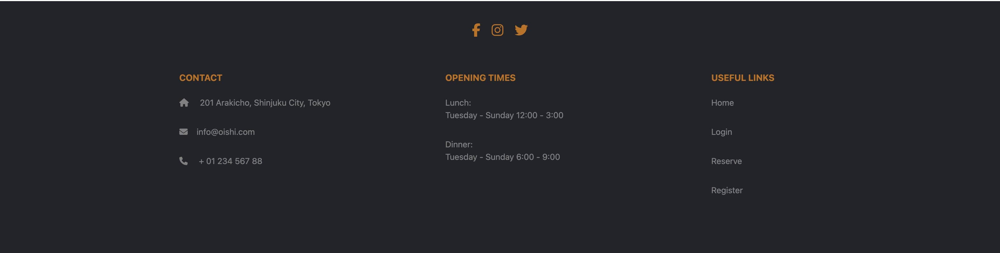
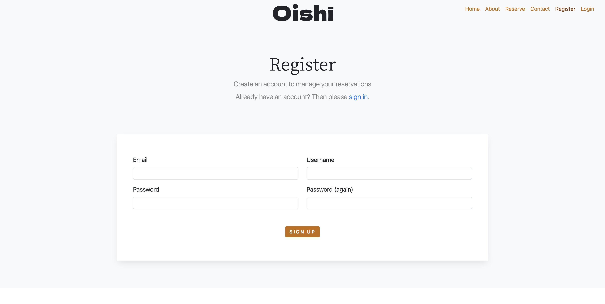
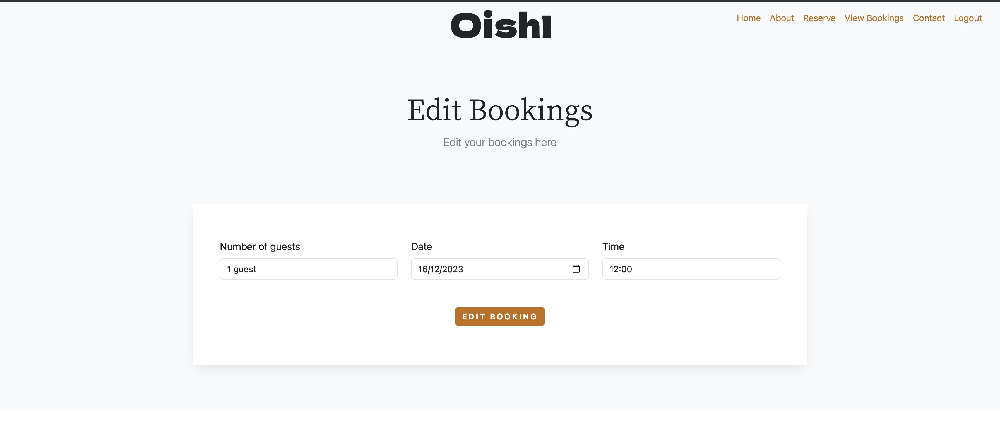

# Oishi Restaurant

[Live application can be found here](https://oishi-restaurant.herokuapp.com/)

This is a full-stack framework project built using Django, Python, HTML, & CSS. The website is built for a fictional Japanese restaurant called Oishi as an educational project for Code Institue's portfolio four. It is designed to showcase the restaurant and allow the customer to make, edit and delete reservations through their account. 

---
## UX

## Strategy
Using the core UX principles I first started with Strategy, thinking about the target audience for this restaurant & the features they would benefit from.

The target audience for the website are:
- 25-60 year olds
- People interested in food, fine-dining and eating-out
- People that are interested in culture, travel and local hotspots

These users will be looking for:
- A user-friendly website that balances information with an aesthetic that communicates the restaurant's values and reflects target customers
- Information about the restaurant, types of dishes it serves and who runs it
- A way to book a table 
- A way to view and manage reservations
- Contact information
- A way to easily access social media accounts form the website

 It is increasingly common for people to make restaurant reservations on the go from their mobile devices. Therefore, creating a mobile friendly website is essential. Bootstrap grids and elements along side custom CSS has benn used in the front-end creation. 

## User Stories

1. As a  user I can intuitively navigate through the site so that I can view desired content.
2. As a user I can get key information about the restaurant from the home page.
3.  As a non-logged in user I can make a booking quickly without having an account.
4. As a non-logged in user I can register an account to view and manage my bookings.
5. As a user I can easily see if I'm logged in or not and have easy access to the logout page. 
6. As a logged in user, form fields like email and username are auto-populated in the booking form.  
7. As an admin user I can view all the customer bookings. 
8. As an admin user I can add tables to the Table model.
9. As an admin user I can add bookings, edit and delete bookings. 
10. As a logged-in customer I can edit/delete an existing enquiry so that I can make changes if required online.
11. As a user I can edit my customer information so that I can make sure my details are up to date for any future communication with the restaurant.

## Scope
As a MVP the website has to achieve the desired user & business goals, the following features will be included in this version:

- A responsive navbar that will have links to all the sections and pages in the website
- A visually strong landing page that entices the user on to further exploration of the business 
- About section, with a brief suitable description and three images. 
- Specials section showcasing some of the menu items on offer. 
- Chef section describing the head chef with an image. 
- Reservations section, where logged-in users can make reservations.
- A footer section with contact information, social media links and opening times. 
- Register and login pages using Django allauth.
- A logout page for logged in users.  

## Design

### Brief
The website aims to convey the brand values through mostly visual language and the use of powerful images to convey to the user its identity and ethos. 
Therefore, a strong landing image was used. This also entices a new user to explore the website firther and find out more. 

### Colours
The website uses a light theme throughout. This works well in creating a clean, modern and refined feel to the content.
Section headings utilize a dark grey offering contrast and easy readibility.
A orange hue was choosen for the sub-headings and buttons. This was picked form the home image using [imagecolorpicker.com](https://imagecolorpicker.com/). As well as giving
a strong contrast it offers a sense of continuity and  harmony as these colours will have been first notices upon the landing page image. 
As one scrolls dowen through the sections the backgorund colour changes from a shade of white to a light grey.

### Fonts
Google fonts Dela Gothic One is used on the brand logo. Its thick bold character design shows a confidence and energy that alins with the restaurant's brand  values. 
It also constrasts well with the background image and prevents an over-seriousness creeping in from the minimal sans-serif used in the nav-bar links and texts in the website. 

Noto Serif JP, again from Google fonts, is used on the section headings. It links well to the Japanese heritage of the restaurant while still being subtle and refined.

Sans-serif is used on the paragraphs section of the website. It offers a clean, refined and legible design, which makes it easy to read on screens of different sizes and resolutions. It has a neutral appearance and doesn't have any distracting features that can make it difficult to read. 

### Agile

Agile  was used to keep development in line with the core requirments of the project. In Github a kanban board was created where the user stories 
were located. This made it easy to keep on track of getting the essential aspects of the project covered as well as being able to see progress happening as 
the project progressed. 

### Database Design

I used two custom models to handle the booking data from the restaurant. 
     
#### Table Model

This stores the tables in the restaurant. Each table has a number and the amount of seats.

| Field Name         |   Field Type    | Validation |
| ------------- | ------------- | ------------- |
| table no         | Integer          | unique=True | 
| table seats           | Integer        | -    | 

#### Booking Model

The Booking Model stores all the restaurant bookings. It stores the date, time, number of guests, table, customer name and email.
The table field is taken form the Table model and the customer name from the logged in Allauth user.
It also has a guest name field for non-registered users in which case the customer field is not used. 

| Field Name         |   Field Type    | Validation |
| ------------- | ------------- | ------------- | 
| date         |   DateField      | null=False, blank=False | 
| time         | CharField        |default = '12:00', max_length=100, choices = time_choices |
| number of guests| category_image   | default = 1, choices = guest_choices  | 
| customer name    | ForeignKey    | on_delete=models.CASCADE, null=True |
| guest name       | CharField       |max_length=100, null=True |       
| table      |ForeignKey      | Table, on_delete=models.CASCADE, null=False |
| email      |EmailField      | null=False, blank=False | 

## Features
### Navigation Bar & Landing Page

Navigation bar: Situated on the top-right of the pages, provides the user with a clear and easily identifiable way to go between the sections and pages. The page that the user is on has an 'active' style, the text turns a darker orange to show to the user the current page they're on. When a nav link is hovered on the same style change occurs, again helping th euser navigate easily.

Wither the user is logged in or logger out will determine wither nav links are shown or not; only logged in users can will see the "logout" link and likewise only
logged out users willl see the "login" and "register" links. 
This prevents any fustration on the users part, keeps the screen clutter free and enables easier navigation. Furthermore, it makes it clear what the logged-in status is to the user.
In terms of styling, the navigation links strike a balance between being easily located while also discrete enough as not to distract for the main landing images visual power.
The navigation bar is fully responsive and collapses on mobile screens to a hamburger icon on smaller sized screens. 

Logo: The logo sits in the center of the nav-bar. This works well with the image used as it draws the eye from the central action in the photo natuarlly to the logo and back. It uses an off-white colour to stand out.

 
### About Section

 This provides the user with a brief to the point description of the restaurant. It purpose is to entice further exploration of the site as well as using
images to convey the emotions and atmosphere the brand wishes to communicate; that is, a sense of location, identity and energy
A Bootstrap card template was used to make this section with the text sections removed. 

### Specials Section

In this section further details are given on some of the signature dishes on offer along with an  accompaning image.
A Bootstrap card template was modified to make this section. The use of the colour for the subheadings as well as being capitalised
helps add variation and injects a hint of colour to the texts. 
  

### Chef Section

Here a description of the head chef and his background is given with a suitable image in a circular frame. All section headings and texts are kept in the 
same format throughout the website. 

### Reserve Section

Reservation form: This section the booking form. If logged in,  the user will only enter the date, time and numberof guests to make a booking.
The email field and customer name fields are taked from Allauth. It was important that the logged in user wouldn't have to repeat 
entering personal information in the booking form as it woul be fustrating for a registered user. 
If a the user is a guest, then they will have to enter their email address, name as well as the other booking fields.
If the guest wishes to view their booking they will have to register an account. Using either the same email or username will fetch their bookings. 
 

### Footer Section

The footer displays some of the restaurants key information. It is split into four sections, social medial links, 'Opening Times', 'Contact', 
and 'Useful Links'. It utilizes a dark grey background and has the effect of giving a strong base to the website. 

### Register/Login/Logout pages

 This is done through Allauth. In setting up an account a email is necessary. This is because a user is more likely to use the same 
 email address rather that username if they make a booking as a guest first and then wish to register an account. Also, the restaurant needs a point of contact.
 The same form template is used throughout with tweeks made accoreding to the number of fields rendered to allow for the most symetrical rendering. 

### View Bookings page

Here logged in users are able to view the 'view bookings' page; if not logged in they are redirected to the sign in page. 
In the view bookings page their bookings are displayed in a table in order of date. All reservation they have previously made using the email address associated with their user account will be shown. 
A Bootstrap table template is used to easily and clearly present the details. 

### Edit/Cancel Booking pages

on these pages the user can change or delete their bookings. If deletind a booking they are redirected abck to the view bookings page where a confirmation message will appear. On the edit page new booking enquiries can be made. 

## Technologies Used

### Languages & Frameworks

- HTML 
- CSS
- Javascript
- Boostrap 
- Python 
- Django 

### Libraries & Tools

- [GitHub](https://github.com/) was used as a remote repository to store project code
- [Bootstrap](https://getbootstrap.com/). This project uses the Bootstrap library components such as (Navbar, Buttons, Card, Footer,)
- [Google Fonts](https://fonts.google.com/) - for typography in project
- [Lucidcharts](https://lucid.app/) has been used to design  data model logic.

- [Cloudinary](https://cloudinary.com/) to store static files

- [Favicon.io](https://favicon.io) for making the site favicon
- [Chrome dev tools](https://developers.google.com/web/tools/chrome-devtools/) was used for debugging of the code and checking site for responsiveness

