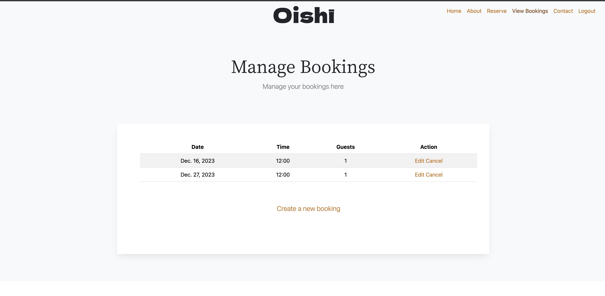

# Oishi Restaurant

[Live application can be found here](https://oishi-restaurant.herokuapp.com/)

## About
This is a full-stack framework project built using Django, Python, Javascript, HTML, & CSS. The website is built for a fictional Japanese restaurant called Oishī as an educational project for Code Institue's portfolio four. It is designed to showcase the restaurant and allow the customer to make, edit and delete reservations through their account. 

## Business Goals
- Communicates the restaurants brand values and identity through visual language, styling and text.
- Entice interest and further exploration upon landing on the website.
- Appeal to the target demographic.
- Provide the potential customer with a platform to book a table at hte restaurant.
- Provide the potential customer necessary essential information about the restaurant.
 

---
## User Experience

### Target Audience

- 25-60 year olds.
- People interested in food, fine-dining and eating-out.
- People that are interested in culture, travel and local hotspots.

### User Requirements and Expectations
- A user-friendly website that balances information with an aesthetic that communicates the restaurant's values and appeals to the target customers.
- A mobile friendly website as bookings are often made on the go. 
- Information about the restaurant, types of dishes it serves and who runs it.
- A way to book a table.
- A way to view and manage reservations.
- Contact information and address.
- A way to easily access social media accounts form the website.

## User Stories

Agile  was used to keep development in line with the core requirments of the project. In Github a kanban board was created where the user stories 
were located. This made it easy to keep on track of getting the essential aspects of the project covered as well as being able to see progress happening as 
the project progressed.

1. As a user I can intuitively navigate through the website so that I can easily access key information and view desired content. 
2. As a user I can easily see if I'm logged in or not so that I can choose to log in or log out depending on what I'm doing.
3. As a non-registered user I can make a booking so that I don't need to spend time setting up an account..
4. As a non-registered user I can set up an account so that I can view and manage potential bookings or any previously made bookings
5. As a logged in user I can make a booking without filling in account information like name and email so that bookings can be made easily without causing annoyance.
6. As a logged in user I can easily view all my bookings so that I can see any upcoming reservations.  
7. As a logged in user I can edit an existing booking so that I can change the time, date or number of guests of a booking.
8. As a logged in user I can delete an existing booking so that I can remove any unwanted reservations.
9. As an admin user I can view all the customer bookings. 
10. As an admin user I can add and delete tables in the Table model.
11. As an admin user I can add, edit and delete bookings. 

## Scope
As a MVP the website has to achieve the essential user & business goals. The following features will be included in this version:

- A responsive navbar that will have links to all the sections and pages in the website.
- A visually strong landing page that entices the user on to further exploration of the business.
- Visual language and styling that reflects the brands values and appeals to the target audience.
- About section with a brief suitable description of the restaurant with three images. 
- Specials section showcasing some of the menu items on offer. 
- Chef section describing the head chef with an image. 
- Reservations section, where logged-in and logged-out users can make reservations.
- A footer section with contact information, social media links, site links and opening times. 
- Register and login pages using Django Allauth.
- A view bookings page to manage bookings.
- An edit bookings page.
- A delete bookings page.
- A logout page for logged in users.  

## Front-End Design

### Brief
- Communicate the brand values through through visual language, styling and text.
- Appeal to the target audience. 
- Easily  navigate and locate necessary information for optimal user expeerience.

### Images

- A strong landing image is used. This entices interest urging a potential customer to explore the website further and find out more. 
- Further images are used to communicate brand values, offer visual stimulation and provide information such as images of dishes and the head chef. 

### Colours
#### Background Colours
- The website uses a light theme throughout. This works well in creating a clean, modern and refined feel to the content as well as enhancing readability.
- As one scrolls down through the sections, the backgorund colour changes from a shade of white to a light grey giving a subtle sense of seperation to the content.

#### Styling Colours

- The brand logo, section headings and the footer background utilize a dark grey, offering contrast and easy readibility.
- The home page brand logo uses a shade of white to stand out. 
- A orange hue was choosen for the sub-headings, buttons and as a hover border on form fields. This was picked form the home image using [imagecolorpicker.com](https://imagecolorpicker.com/).
As well as achieving a strong contrast it offers a sense of continuity and  harmony as these colours will have been first noticed upon viewing the landing page image.
- A darker shade of this orange was used to show the active navigation link.
- Paragraph text colour is grey offering a clean minimal look as well as good readability.

### Fonts
- Google fonts Dela Gothic One is used on the brand logo. 
Its thick bold character design and Japanese influence alins well with the brands confidence, youthfullness and location. 
It also constrasts well with the background image and prevents an over-sterile feel creeping in from the minimal sans-serif used in the nav-bar links and texts in the website. 

- Noto Serif JP, again from Google fonts, is used on the section headings. It links well to the Japanese heritage of the restaurant while still being subtle and refined.

- Sans-serif is used on the paragraphs section of the website. It offers a clean, refined and legible design, which makes it easy to read on screens of different sizes and resolutions. It has a neutral appearance and doesn't have any distracting features that can make it difficult to read. 

## Back-End Design

### User Model
- User model as part of the Django allauth library contains basic information about authenticated user and contains folowing fields: username, password,email
     
### Table Model

- This custom model stores the tables in the restaurant.
- Each table has a number and the amount of seats.

### Booking Model

- This custom model holds all the restaurant bookings. 
- It stores the date, time, number of guests, table, customer name and email.
- The table field is taken form the Table model and the customer name from the logged in Allauth user model.
- It also has a guest name field for non-registered users in which case the customer field is not used. 

### Flowchat

- When making a booking on the reservation section, the form fields deisplayed will depend on th user being loggged in or not.
- It was import that logged in users were not entering account information like username and email as this would be fustrating. 
- Equally, it was important that non-registered users could make a booking without having to go through the sign up process. Therefore, a guest user field was included in the Booking model to  handle this. The guest will haver to enter thier email when making a booking. Any  past bookings accociated  with this email will be retrivied if the user decides to create an account later. 
- Once the booking form is validated it the code checks if ther are any available tables.
- If so, it was important that tables were assigned according to the number of guests, not just the first table from the Table Model.
- The code then finds the best matched table to exclude or lower the number of empty seats. 
- If more that three empty seats is the only availability the booking will not proceed as there will be too many empty seats.

## Features

### Navigation Bar & Landing Page

Situated on the top-right of the pages, provides the user with a clear and easily identifiable way to go between the sections and pages. The page that the user is on has an 'active' style, the text turns a darker orange to show to the user the current page they're on. When a nav link is hovered on the same style change occurs, again helping th euser navigate easily.

Wither the user is logged in or logger out will determine wither nav links are shown or not; only logged in users can will see the "logout" link and likewise only
logged out users willl see the "login" and "register" links. 
This prevents any fustration on the users part, keeps the screen clutter free and enables easier navigation. Furthermore, it makes it clear what the logged-in status is to the user.
In terms of styling, the navigation links strike a balance between being easily located while also discrete enough as not to distract for the main landing images visual power.
The navigation bar is fully responsive and collapses on mobile screens to a hamburger icon on smaller sized screens. 

Logo: The logo sits in the center of the nav-bar. This works well with the image used as it draws the eye from the central action in the photo natuarlly to the logo and back. It uses an off-white colour to stand out.

 
### About Section

- This provides the user with a brief to the point description of the restaurant. It purpose is to provide information and visual stimulation as well as entice further exploration.

### Specials Section

- In this section further details are given on some of the signature dishes on offer along with an  accompaning image.
- A Bootstrap card template was modified to make this section. The use of the colour for the subheadings as well as being capitalised
helps add variation and injects a hint of colour to the texts. 
  
### Chef Section

- Here a description of the head chef and his background is given with a suitable image.

### Reserve Section

- The displayed reservation form fields will depend on wither the user is logged in or not. 
- Links in the description are provided for easy access to the login and register pages for logged out users. 
- For logged in users a link os provided to the view bookings page.  
 
### Register/Login/Logout pages

 This is done through Allauth. In setting up an account a email is necessary. This is because a user is more likely to use the same 
 email address rather that username if they make a booking as a guest first and then wish to register an account. Also, the restaurant needs a point of contact.
 The same form template is used throughout with tweeks made accoreding to the number of fields rendered to allow for the most symetrical rendering. 

### Manage Bookings page

- Only accessible to logged in users.
- Here their bookings are displayed in a table in order of date. All reservation they have previously made using the email address associated with their user account will be shown.
- Each booking has a link to the edit booking and cancel booking pages. 
- A Bootstrap table template is used to clearly present the details.
- A link is provided to the reservation section to make new bookings. 

### Edit/Cancel Booking pages

- Only accessible to logged in users through the Manage Bookings page. 
- On these pages the user can change or delete their bookings.
- If a booking is deleted, they are redirected abck to the view bookings page where a confirmation message will appear.
- On the edit page new booking enquiries can be made. 

### Footer Section

- The footer displays some of the restaurants key information. It is split into four sections, social medial links, 'Opening Times', 'Contact', 
and 'Useful Links'. 
- It utilizes a dark grey background and has the effect of giving a strong end to the website. 

## Technologies Used

### Languages & Frameworks

- HTML 
- CSS
- Javascript
- Boostrap 
- Python 
- Django 

### Libraries & Tools 

- [Django](https://www.djangoproject.com/) Django is the framework that has been used to build the over project and its apps.
- [GitHub](https://github.com/) was used as a remote repository to store project code
- [Bootstrap](https://getbootstrap.com/). - This project uses the Bootstrap library components such as (Navbar, Buttons, Card, Footer,)
- [Google Fonts](https://fonts.google.com/) - For fonts used in the project.
- [Font Awesome](https://fontawesome.com/)- Used to obtain the social media icons used in the footer section. 
- [Cloudinary](https://cloudinary.com/) to store static files
- [Bootstrap](https://getbootstrap.com/) - Used for creating the HTML templates.
- [Lucidcharts](https://lucid.app/) has been used to design  data model logic.
- [Heroku](https://dashboard.heroku.com/apps) - Used to deploy my application.

- [Favicon.io](https://favicon.io) for making the site favicon
- [Chrome dev tools](https://developers.google.com/web/tools/chrome-devtools/) was used for debugging of the code and checking site for responsiveness

---
## Technologies Used

I have used several technologies that have enabled this design to work:

- [Python](https://www.python.org/)
    - Python is the core programming language used to write all of the code in this application to make it fully functional.

- [Google Fonts](https://fonts.google.com/)
    - Used to obtain the fonts linked in the header, fonts used were Raleway and Lobster
- [Font Awesome](https://fontawesome.com/)
    - Used to obtain the icons used on the high scores and rules pages.
- [Google Developer Tools](https://developers.google.com/web/tools/chrome-devtools)
    - Used as a primary method of fixing spacing issues, finding bugs, and testing responsiveness across the project.
- [GitHub](https://github.com/)
    - Used to store code for the project after being pushed.
- [Git](https://git-scm.com/)
    - Used for version control by utilising the Gitpod terminal to commit to Git and Push to GitHub.
- [Gitpod](https://www.gitpod.io/)
    - Used as the development environment.
- [Heroku](https://dashboard.heroku.com/apps)
    - Used to deploy my application.
- [Lucid](https://lucid.app/documents#/dashboard)
    - Used to create the ERD for the project.
- [Grammarly](https://www.grammarly.com/)
    - Used to fix the thousands of grammar errors across the project.
- [ImageResizer](https://imageresizer.com/)
    - Used to resize images to reduce loading time.
- [Pep8](http://pep8online.com/)
    - Used to test my code for any issues or errors.
- [Grammarly](https://www.grammarly.com/)
    - Used to fix the grammar errors across the project.
- [Unicorn Revealer](https://chrome.google.com/webstore/detail/unicorn-revealer/lmlkphhdlngaicolpmaakfmhplagoaln?hl=en-GB)
    - Used to detect overflow of elements, which allowed me to quickly debug any issues.
- [Coloors](https://coolors.co/)
    - Used to create a colour palette for the design.
- [Cloudinary](https://cloudinary.com/)
    - Used to store all of my static files and images.
- [Favicon.io](https://favicon.io/)
    - Used to create favicon's for my website
- [Color Contrast Accessibility Validator](https://color.a11y.com/)
    - Allowed me to test the colour contrast of my webpage.
- [W3C Markup Validation Service](https://validator.w3.org/) 
    - Used to validate all HTML code written and used in this webpage.
- [W3C CSS Validation Service](https://jigsaw.w3.org/css-validator/#validate_by_input)
    - Used to validate all CSS code written and used in this webpage.
- [JSHint](https://jshint.com/)
    - Used to validate JS code
- [Freeformatter CSS Beautify](https://www.freeformatter.com/css-beautifier.html)
    - Used to accurately format my CSS code.
- [Freeformatter HTML Formatter](https://www.freeformatter.com/html-formatter.html)
    - Used to accurately format my HTML code.
- [AmIResponsive](http://ami.responsivedesign.is/)
    - Used to generate responsive image used in README file.
- [Wave](https://wave.webaim.org/)
    - Used to test the accessibility of the website.
- [Animate](https://animate.style/)
    - Used to animate main heading and forms. 
- [SQLite](https://www.sqlite.org/index.html)
    - I have SQLite to run my database tests locally.
- [PostgreSQL](https://www.postgresql.org/)
    - I have used Heroku's PostgreSQL relational database in deployment to store the data for my models.
---